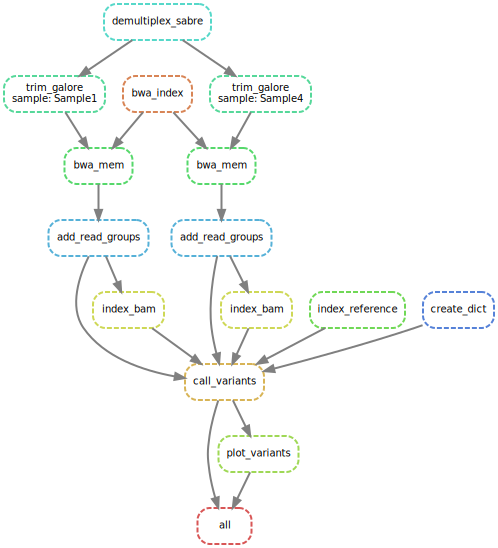

# Fast-GBS Pipeline

This repository contains a Snakemake pipeline for the Data Processing course.

The pipeline works in the following order:
1. Demultiplexing sequencing data using Sabre
2. Adapter trimming using Trim Galore
3. Generating an alignment index using BWA
4. Read mapping using BWA-MEM
5. Adding read group information using GATK
6. Indexing the BAM file using SAMtools
7. Variant calling using GATK
8. Generating a scatterplot of variant calling quality scores using Python

## Prerequisites

To run this pipeline, you need to have the following software installed:
- Conda or Mamba
- Snakemake

## Installation

1. Clone this repository:
```
git clone https://github.com/niek265/dataprocessing.git
cd dataprocessing
```


2. Create a conda environment using the provided `environment.yml` file with all dependencies:
```
conda env create -f environment.yml
```


3. Activate the conda environment:
```
conda activate dataprocessing
```

## Configuration

The pipeline is configured using the `config/config.yml` file. Please update the file with your desired paths and settings. The available settings are:

- `data_directory`: Directory where the data is stored, this is also where the additional genome files will generate
- `results_directory`: Directory where the results will be stored
- `read_name`: Name of the reads file, the files must be paired-end and have the same name with the only difference being the _1 and _2
- `genome`: Name of the reference genome file, this file must be in the data directory
- `barcode_file`: Name of the barcode file, this file must be in the data directory
- `trim_galore_min_length`: Minimum length of reads to be kept after trimming

## Input

The pipeline requires the following input files:
- Paired-end FASTQ files
- Reference genome file
- Barcode file


## Running the Pipeline

With the conda environment activated, run the Snakemake pipeline:

```
snakemake --cores <number_of_cores>
```

## Output

The pipeline creates these output files:

- Multiple index and dictionary files of the reference genome
- Demultiplexed FASTQ files
- Trimmed FASTQ files
- Mapped BAM reads
- Variants VCF file
- Scatterplot with variant calling quality scores (PNG)

## Directed Acyclic Graph (DAG)


